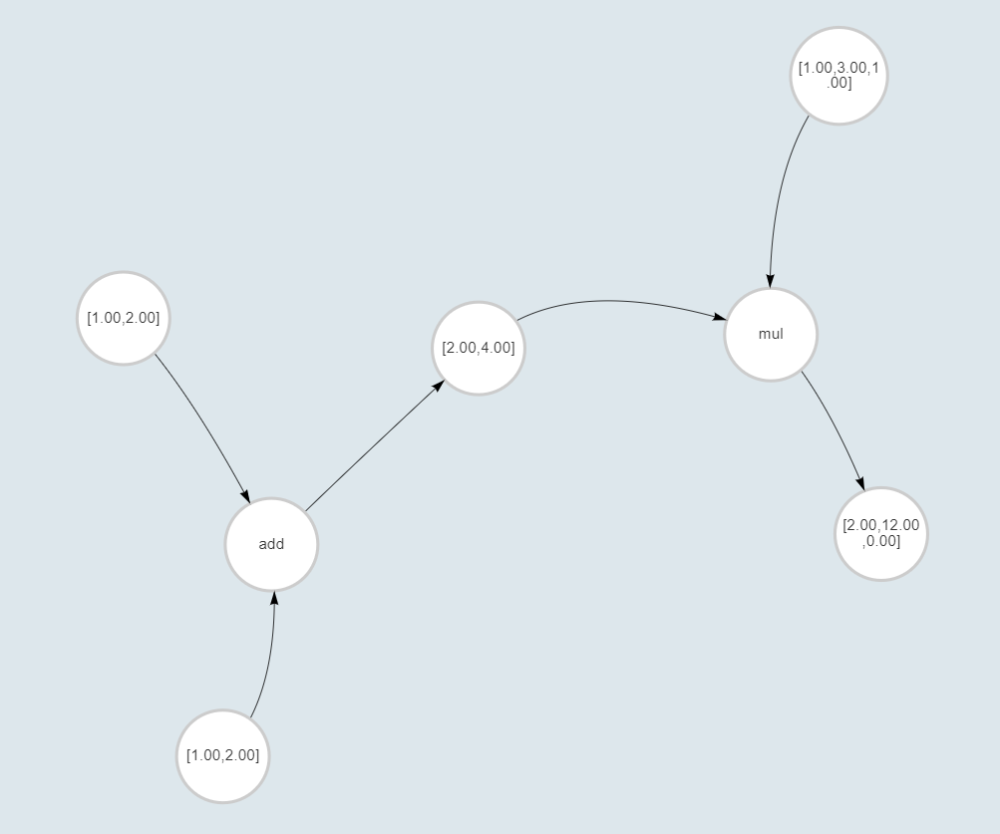

## Задание

Разработать веб-приложение для произведений работы над векторами.

## Инструкция по запуску

Приложение написано на Django и React, СУБД - PostgreSQL
В вашей системе должно быть установлено: Python3.7+, PostgreSQL 12+

### Подготовка

> git clone https://github.com/chernrina/test_task_vector_graph_operations.git

Создание пользователя и базы данных для приложения:
> psql -U postgres -f db.sql

>cd test_task

Необходима установка следующих packages:
> pip install -U Django 

> pip install django-crispy-forms

> pip install rest_framework

> pip install djangorestframework

> pip install psycopg2

Миграции для создания таблиц в базе данных:
>python manage.py makemigrations

>python manage.py migrate

Запуск сервера:
>python manage.py runserver

### Использование

По адресу 127.0.0.1 - главная страница с двумя кнопками: get started(регистрация пользователя) и login(авторизация)

После авторизации/регистрации открывается личная страница пользователя с существующими проектами(графами). Кнопка create project позволяет создать проект и перейти к его редактированию.
По нажатию на элемент существующего проекта также происходит переход к его редактированию.

Редактор - содержит 4 кнопки (show graph, save, calculate, recalculete) с левой стороны страницы, в центре - отображение, справа -  элементы для создания узлов и ребер графа.

show graph - отображает граф,
save - сохраняет изменения,
calculate - сохраняет и вычисляет одну новую (последнюю) созданную операцию (последний созданный узел операции)
recalculate - сохраняет и пересчитывает все значения в графе

Создание узлов и ребер:
1. создание узла включает в себя индекс (integer от 0), тип (value,operation), значение (важно указать через запятую в квадратных скобках)
2. создание ребра включает в себя индекс начального и конечного узлов

>Важно! Для создания узла типа operation в поле value нужно ввести [1] - узел add; [2] - узел mul

> ! При первом создании графа перед вычислениями нажать save

### Проблемы

При вычислениях иногда возникает Internal Server Error (500) - не исправлено. Если возникает, следует повторить последние действия.

После calculate/recalculate сохранения не происходит, при необходимости сохранения следует нажать кнопку save.
